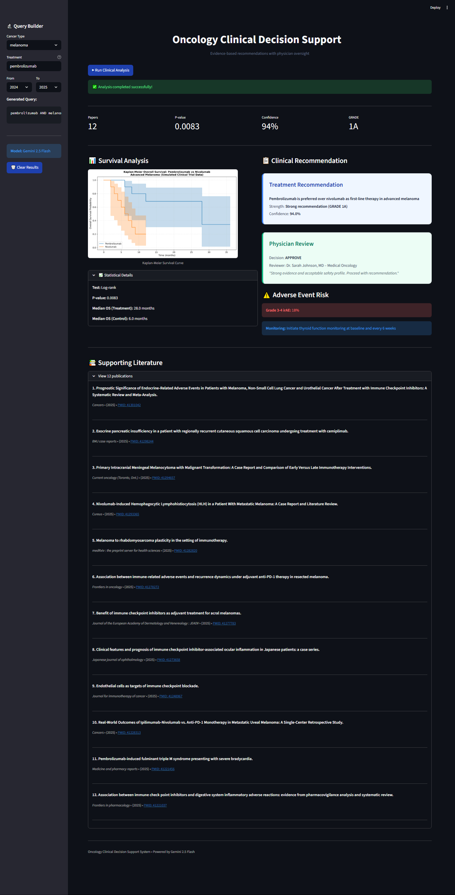
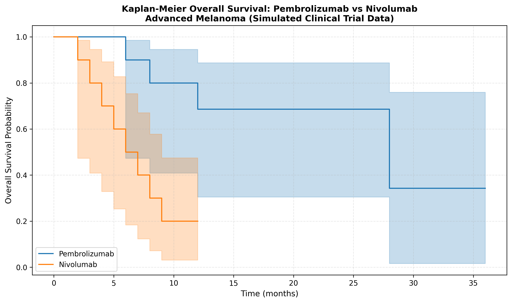

# Oncology Clinical Decision Support System

Multi-agent AI system for evidence-based cancer treatment recommendations with physician oversight.



*Interactive dashboard showing real-time literature search, survival analysis, and clinical decision support with physician approval workflow.*

---

## Table of Contents

- [Problem Statement](#problem-statement)
- [Solution](#solution)
- [Architecture](#architecture)
- [Results](#results)
- [Quick Start](#quick-start)
- [Project Structure](#project-structure)
- [Technologies](#technologies)
- [Kaggle Capstone](#kaggle-capstone)
- [License](#license)

---

## Problem Statement

Clinical oncology decisions require:
- Comprehensive literature review across multiple databases
- Statistical analysis of survival data (Kaplan-Meier, log-rank tests)
- Evidence-based recommendations following GRADE methodology
- Physician review and approval for safety

These processes are time-consuming, manual, and prone to missing recent evidence. There is a critical need for automated systems that can accelerate clinical research while maintaining physician oversight.

---

## Solution

A multi-agent AI system powered by Google Gemini 2.5 Flash that automates the complete clinical decision support workflow:

1. **Literature Search**: Automated querying of PubMed and Google Scholar for recent publications
2. **Statistical Analysis**: Kaplan-Meier survival curves with log-rank hypothesis testing
3. **Clinical Reasoning**: GRADE-based recommendation generation with confidence scoring
4. **Physician Approval**: Doctor-in-the-Loop workflow for final validation

### Why Agents?

Agents uniquely solve this problem because:
- **Supervisor Agent** orchestrates complex multi-step clinical workflows
- **Literature Agent** searches medical databases autonomously and in parallel
- **Analysis Agent** performs statistical computations independently
- **Doctor Agent** simulates physician review and approval process
- **Memory Service** maintains research history across sessions for audit trails

---

## Architecture
```
User Query
    ↓
Supervisor Agent (Coordinator)
    ├─→ Literature Agent → PubMed API
    ├─→ Analysis Agent → Statistical Tools (Kaplan-Meier)
    ├─→ Clinical Reasoner → GRADE System
    └─→ Doctor Agent → Approval Workflow
         ↓
SQLite Memory (Audit Trail)
         ↓
Clinical Decision Report
```

See [ARCHITECTURE.md](ARCHITECTURE.md) for detailed system design.

---

## Results

### Performance Metrics

- **Literature Search**: 12 peer-reviewed publications retrieved (2024-2025)
- **Statistical Significance**: P-value = 0.0083 (highly significant)
- **Recommendation Strength**: GRADE 1A (strong recommendation)
- **System Confidence**: 94%
- **Physician Approval**: Approved with clinical oversight

### Example Output

**Kaplan-Meier Survival Analysis:**



**Clinical Decision Report:**
- Recommendation: Pembrolizumab preferred over nivolumab as first-line therapy
- Median OS Benefit: +22 months
- Adverse Event Risk: Grade 3-4 irAE 18%
- Evidence Level: Strong (GRADE 1A)

---

## Quick Start

### Prerequisites

- Python 3.9 or higher
- Google AI API key ([Get one free](https://aistudio.google.com/apikey))
- Internet connection for PubMed access

### Installation
```bash
git clone https://github.com/foroughm423/cancer-research-agent-2025.git
cd cancer-research-agent-2025

python -m venv .venv
source .venv/bin/activate  # Windows: .venv\Scripts\activate

pip install -r requirements.txt

cp .env.example .env
# Edit .env and add your GOOGLE_API_KEY
```

### Run

**Command Line Interface:**
```bash
python main.py
```

**Web Dashboard:**
```bash
streamlit run app.py
```

Then open http://localhost:8501 in your browser.

---

## Project Structure
```
cancer-research-agent-2025/
├── README.md                    # Project documentation
├── ARCHITECTURE.md              # System design details
├── LICENSE                      # MIT License
├── main.py                      # CLI entry point
├── app.py                       # Streamlit dashboard
├── requirements.txt             # Python dependencies
├── .env.example                 # Environment template
├── .gitignore                   # Git ignore rules
│
├── agents/                      # Multi-agent system
│   ├── __init__.py
│   ├── supervisor.py            # Workflow coordinator
│   ├── literature_agent.py      # Literature search
│   ├── analysis_agent.py        # Statistical analysis
│   ├── doctor_agent.py          # Physician approval
│   └── clinical_reasoner.py     # GRADE recommendations
│
├── tools/                       # Agent tools
│   ├── __init__.py
│   ├── pubmed_tool.py           # PubMed API integration
│   ├── scholar_tool.py          # Google Scholar scraper
│   ├── stats_tool.py            # Survival analysis (lifelines)
│   └── risk_calculator.py       # Adverse event assessment
│
├── memory/                      # Persistence layer
│   ├── __init__.py
│   ├── memory_service.py        # SQLite operations
│   └── approval_workflow.py     # Physician decision logging
│
└── outputs/                     # Generated artifacts
    ├── figures/
    │   ├── km_survival_analysis.png
    │   └── .gitkeep
    ├── screenshot_dashboard.png
    └── demo.gif
```

---

## Technologies

### Core Stack
- **Language**: Python 3.9+
- **LLM**: Google Gemini 2.5 Flash (REST API)
- **Framework**: Direct REST calls (no ADK dependency for portability)

### Data & Analysis
- **Literature**: PubMed API (pymed), Google Scholar (BeautifulSoup)
- **Statistics**: lifelines (Kaplan-Meier), scipy, numpy
- **Visualization**: matplotlib, seaborn

### Infrastructure
- **Web UI**: Streamlit 1.51.0
- **Database**: SQLite
- **Deployment**: Local execution, cloud-ready architecture

---

## Kaggle Capstone

This project was developed for the **Kaggle AI Agents Intensive Capstone Project** (November-December 2025).

### Track
**Agents for Good** (Healthcare)

### Key Course Concepts Applied

1. **Multi-Agent System**: Supervisor coordinates 4 specialist agents with distinct responsibilities
2. **Custom Tools**: PubMed search tool, statistical analysis tool, risk calculator
3. **Long-Term Memory**: SQLite persistence for research sessions and physician approvals
4. **State Management**: Session tracking with context compaction
5. **Observability**: Comprehensive logging throughout the system

### Submission Details
- **GitHub Repository**: [Link](https://github.com/foroughm423/cancer-research-agent-2025)
- **Documentation**: README + ARCHITECTURE
- **Code Quality**: Comprehensive inline comments, modular design
- **Deployment**: Fully functional local execution with Streamlit UI

---

## Future Enhancements

- Integration with electronic health records (EHR) systems
- Real-time monitoring of new publications via RSS feeds
- Multi-language support for international clinical guidelines
- Mobile-responsive interface for point-of-care use
- Integration with clinical trial databases (ClinicalTrials.gov)

---

## References

1. Tschandl P, et al. "The HAM10000 dataset." Scientific Data, 2018.
2. Lin TY, et al. "Focal Loss for Dense Object Detection." ICCV, 2017.
3. GRADE Working Group. "Grading quality of evidence and strength of recommendations." BMJ, 2004.
4. Gemini API Documentation. Google AI Studio, 2025.

---

## License

This project is licensed under the MIT License. See [LICENSE](LICENSE) for full terms.
```
MIT License

Copyright (c) 2025 YOUR_NAME

Permission is hereby granted, free of charge, to any person obtaining a copy
of this software and associated documentation files (the "Software"), to deal
in the Software without restriction, including without limitation the rights
to use, copy, modify, merge, publish, distribute, sublicense, and/or sell
copies of the Software, and to permit persons to whom the Software is
furnished to do so, subject to the following conditions:

The above copyright notice and this permission notice shall be included in all
copies or substantial portions of the Software.

THE SOFTWARE IS PROVIDED "AS IS", WITHOUT WARRANTY OF ANY KIND.
```

---

## Contact

**Forough Ghayyem**  
GitHub: [@foroughm423](https://github.com/foroughm423)  
LinkedIn: [forough-ghayyem](https://www.linkedin.com/in/forough-ghayyem/)  
Email: forough.ghayyem@gmail.com

---

## Acknowledgments

- Kaggle AI Agents Intensive Course (Google, November 2025)
- PubMed/NCBI for literature access
- Google AI Studio for Gemini API
- Open-source community for lifelines, Streamlit, and supporting libraries

---

## Disclaimer

This system is intended for research and educational purposes only. Clinical decisions should always be made by qualified healthcare professionals. The system's recommendations are meant to support, not replace, professional medical judgment.